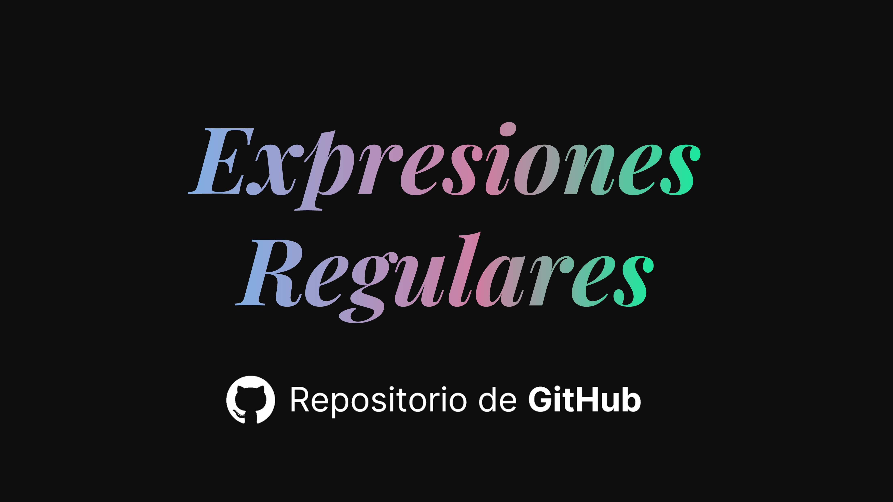

<h1 align="center">📖 Expresiones Regulares 🔍</h1>



<p align="center"><a href="https://unete.platzi.com/p/?utm_campaign=af_z8nz47zasr9n20g7hz8nz47zi3etbtjj">🎁 Descuento de $100 en Platzi Expert+ 💚</a></p>
<p align="center">{ 🖐 <b>Arte de programar</b> es realizado por <a href="https://marceloarias.com">Marcelo Arias (@360macky) 👨‍🚀</a> }</p>


## ✍ Teoría

### 🔬 Probando rangos
Los rangos nos ayudan a establecer los tipos de caracteres con los que queremos trabajar. Y van entre corchetes `[]`.

En el vídeo vimos cómo `[0-9]` nos ayudaba a establecer un rango desde el `0` hasta el `9`. Eso significa que sólo aceptaríamos números. También podemos establecer rangos de letras, o de otros caracteres.

### 🥽 Probando cuantificadores
Para entender las diferencias entre los cuantificadores de `+`, `*`, y `?`, puedes abrir un archivo con varios textos por cada línea en un editor de código, luego abrir la búsqueda por Expresión Regular, y escribir `+`, `*`, o `?` dependiendo de lo que busques.

Por ejemplo, en el vídeo usé `Hola?`, `Hola*` y `Hola+`, con [este archivo](./hola.txt).

```txt
Hol
Hola
Holaa
Holaaa
Holaaaa
Holaaaaa
```

## 🏋️‍♀️ Ejercicios
Puedes encontrar los ejercicios en el notebook Python de este repositorio. Consisten en armar expresiones regulares para detectar ciertas palabras.


## ✍ Autor
* [Marcelo Arias](https://github.com/360macky) (🐦 [Twitter](https://twitter.com/360macky))


## 🙌 Contribuciones
¿Existe algún error en el código? ¿Deseas replantear mejor el problema? ¿Quieres compartir el mismo algoritmo en otro lenguaje? No dudes en abrir un [Pull Request](), si quieres realizar un cambio en este repositorio.
